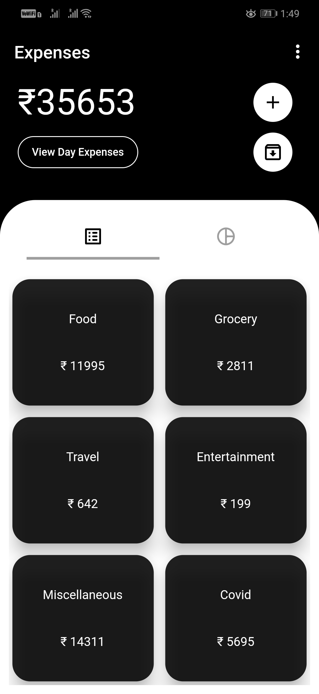
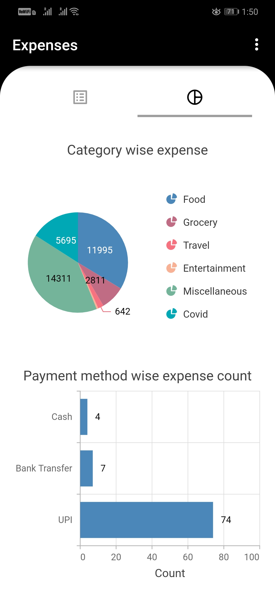
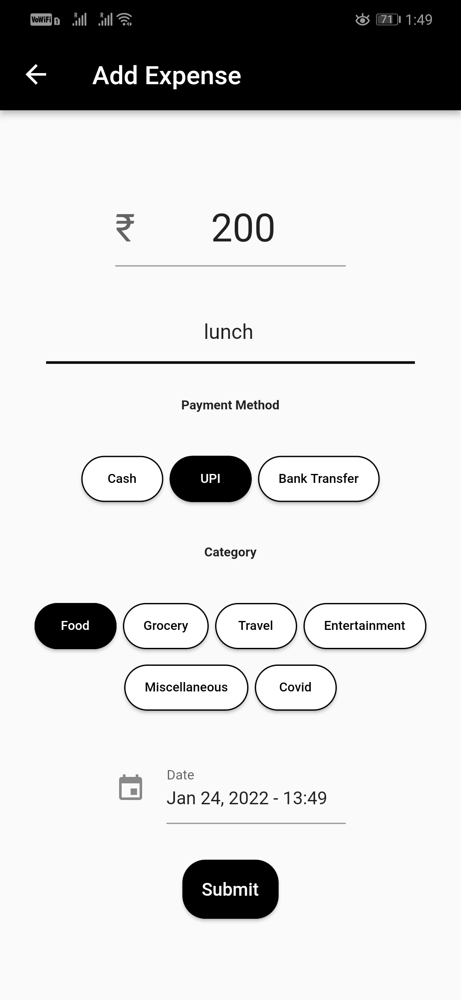
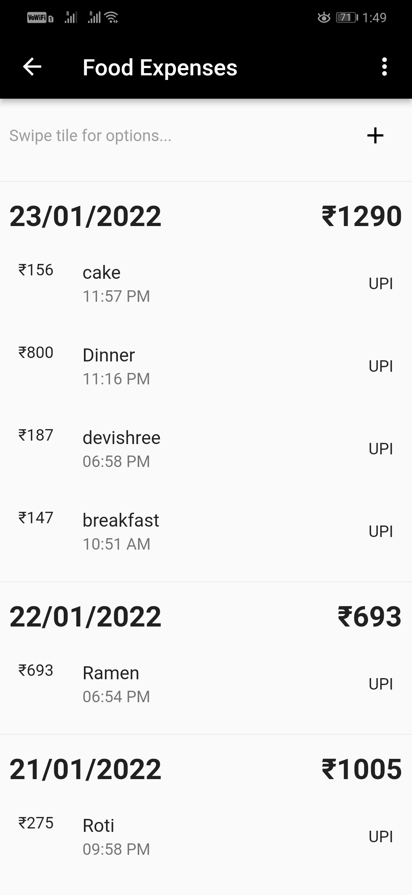
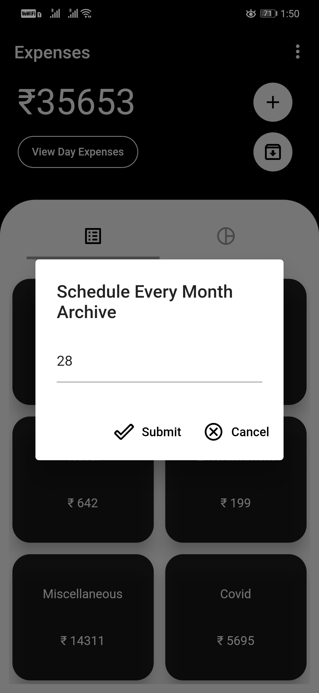
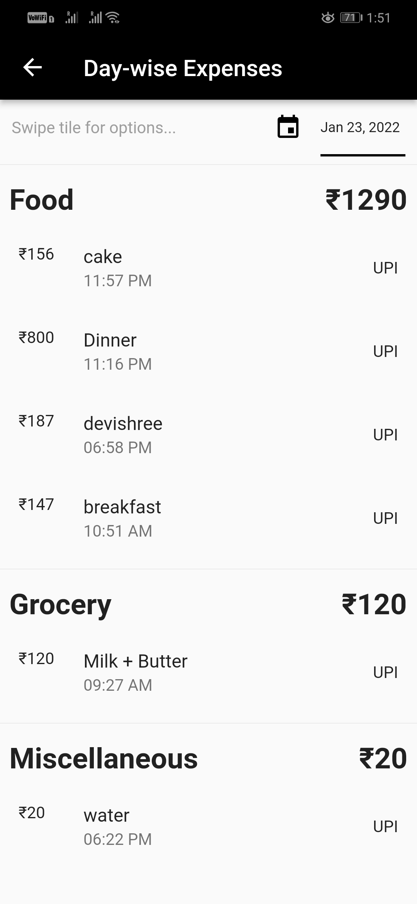

# Expense App - Flutter application to record and visualize monthly expenses

A cross-platform Flutter application that helps you record your expenses and produce visualizations for easier comprehension. Following are the current features of the application:
- Add Expense with an amount, description, Payment Mode, Category and Time
- Edit/Delete expenses
- Add/Edit Categories of Expenses
- Schedule monthly archive of all the expenses
- Export/Import expenses data into the application
- Bar and pie charts to visualize current month expenses
- View Category-wise expenses of the month
- View Day-wise archived/unarchived expenses

## Screenshots

  &nbsp;&nbsp;&nbsp;&nbsp;&nbsp;&nbsp;&nbsp;&nbsp;&nbsp;&nbsp;&nbsp;&nbsp;&nbsp;&nbsp;&nbsp;&nbsp;&nbsp;&nbsp;&nbsp;&nbsp;&nbsp;&nbsp;&nbsp;&nbsp;

#### Link to apk: https://drive.google.com/file/d/1pHo5fQBg_qazIzVRVPB1rDr5ghR5uLkB/view?usp=sharing

## Libraries Used
- Provider: ChangeNotifier used to maintain and update UI state
- Sqflite: Used to store and retreive expenses data in a SQL database
- Syncfusion Flutter Charts : Used to build charts from expenses data
- Sqflite Common Porter : Used to code import/export logic   
